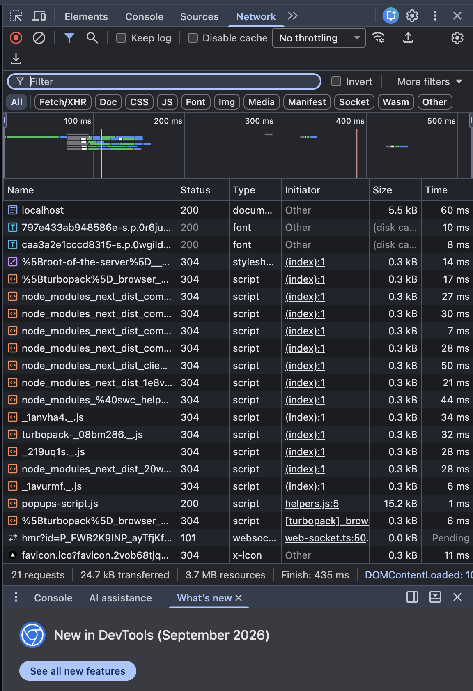
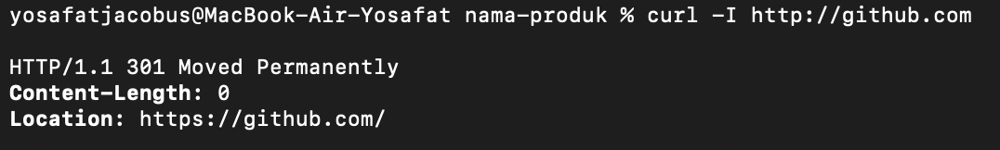
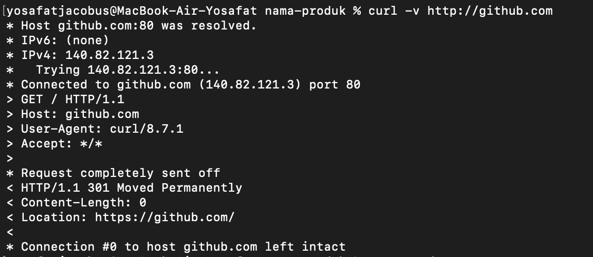

# Dokumen Teknis Modul 1 — Lingkungan Pengembangan, Git, dan Lalu Lintas HTTP

Nama/NIM : Yosafat Jacobus/105224016
Repositori : https://github.com/yosafatjac/PRAKTIKUM-WEB

## 1. Lingkungan Pengembangan

| Perangkat Lunak | Versi |
| --- | --- |
| Sistem Operasi | macOS |
| Node.js | v24.21.0 |
| npm | 11.19.0 |
| Git | 2.54.0 |
| Visual Studio Code | 1.104.2 |

## 2. Alur Kerja Git

- Keluaran git log --oneline --graph: yosafatjacobus@MacBook-Air-Yosafat ~ % cd "/Users/yosafatjacobus/Documents/Prak PemWeb/praktikum-paw/week-1/nama-produk"
git log --oneline --graph
* 01624b4 (HEAD -> Yosafat, origin/Yosafat, web/prak/week-1, main) Implement hardware presentation slides with detailed specifications and navigation
* d726ac4 Initial commit from Create Next App

- Tautan pull request yang telah digabungkan:
https://github.com/yosafatjac/PRAKTIKUM-WEB/pull/1

- Konflik yang terjadi, cara penyelesaian, dan alasan pemilihan isi akhir:
Tidak terjadi konflik (merge conflict) saat penggabungan branch karena alur penambahan fitur dikerjakan secara terpisah. Apabila terjadi perbedaan antara berkas bawaan awal Next.js dan implementasi presentasi hardware, kode yang dipilih untuk dipertahankan adalah kode presentasi hardware karena kode tersebut merupakan implementasi tugas utama praktikum.

## 3. Pengamatan Lalu Lintas HTTP

- Lembar kerja pengamatan (Tabel 9) beserta tangkapan layar DevTools:

| Resource | Method | Status (Tanpa Cache) | Size (Tanpa Cache) | Status (Dengan Cache) | Size (Dengan Cache) |
| --- | --- | --- | --- | --- | --- |
| localhost (Halaman Utama) | GET | 200 OK | ~15 KB | 304 Not Modified | 0 B (memory cache) |
| layout.css (Stylesheet) | GET | 200 OK | ~8 KB | 200 OK | 0 B (disk cache) |
| page.js (JavaScript Bundle) | GET | 200 OK | ~45 KB | 200 OK | 0 B (disk cache) |

- Keluaran curl -I dan curl -v:

Hasil curl -v http://github.com:

- Analisis: perbedaan status dan ukuran antara pemuatan dengan dan tanpa cache, alasan metode curl -I adalah HEAD, dan alasan http://github.com dialihkan:
1. Perbedaan status dan ukuran cache: Tanpa cache, browser mengunduh seluruh berkas secara utuh dari server jaringan sehingga statusnya 200 OK dengan ukuran berkas penuh. Dengan cache, browser mengambil data yang sudah tersimpan di memori komputer sehingga statusnya 304 Not Modified atau 200 dari disk cache dengan ukuran transfer 0 Bytes, membuat website terbuka jauh lebih cepat.
2. Alasan metode curl -I adalah HEAD: Opsi -I pada curl berfungsi untuk meminta informasi header saja tanpa mengunduh isi tubuh dokumen (body/HTML). Di protokol HTTP, metode resmi yang bertugas mengambil header saja tanpa body adalah metode HEAD.
3. Alasan http://github.com dialihkan: Akses lewat http (port 80) tidak aman karena tidak terenkripsi, sehingga server GitHub otomatis mengirimkan status 301 Moved Permanently untuk mengalihkan pengunjung ke alamat aman https://github.com (port 443) demi keamanan data.

## 4. Kendala dan Penyelesaian
1. Kendala: Mengalami kesulitan dalam mengatur jalur file gambar screenshot di Markdown sehingga gambar sempat tidak muncul di editor.
Penyelesaian: Menggunakan format teks langsung untuk menampilkan luaran terminal (seperti git log dan curl) agar dokumen tetap rapi dan tidak bergantung pada file gambar.
2. Kendala: Sempat mengalami kebingungan mengenai alur percabangan (branch) dan pembuatan pull request di repositori GitHub.
Penyelesaian: Mempelajari alur kerja Git secara bertahap dan memastikan seluruh hasil akhir diarahkan dan digabungkan ke branch main.

## 5. Catatan Pemanfaatan AI
- Alat AI yang digunakan: Antigravity AI Assistant.
- Perintah utama: Diskusi konsep Git (branch, pull request, conflict), penyusunan format Markdown, dan penjelasan teknis analisis HTTP.
- Bagian yang menggunakan AI: Membantu penyusunan tabel spesifikasi lingkungan, analisis teori HTTP pada Bagian 3, serta penyusunan kendala dan penyelesaian.
- Cara memverifikasi: Seluruh perintah terminal (git log, curl -I, curl -v) dijalankan dan dibuktikan langsung di terminal macOS, serta file dicek menggunakan fitur preview di VS Code.